## Blind Link BLINK (시대 최적화 블라인드 미팅 )

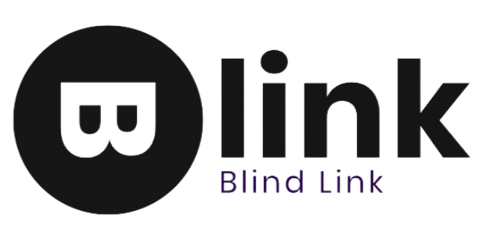

#### Overview

----

**오프라인에서 새로운 만남을 가지기 부담스러우신가요? Blink 을 통해 부담없이 새로운친구를 사귀어 보세요!!!**

#### Blink 의 모토

---

**진짜 너를 보여줘, BLINK✨**

#### Blink 서비스 화면

---

#### 기본 화면

- 처음 서비스에 입장하면 로그인 / 참가 링크를 입력할 수 있는 화면이 나옵니다.

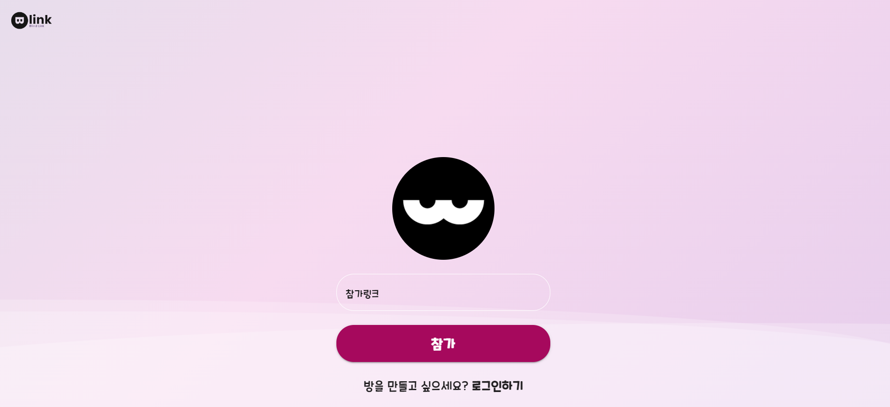

#### 로그인

- 아이디와 비밀번호를 입력하면 로그인 할 수 있습니다.

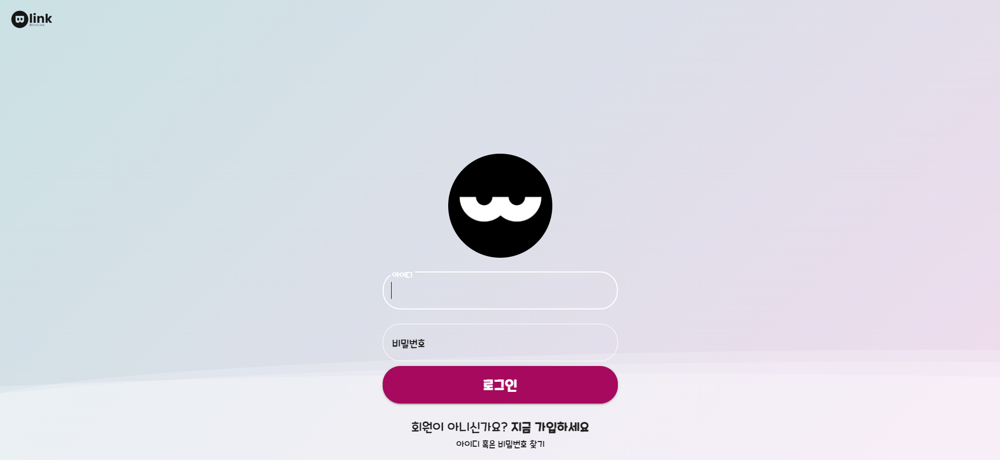

#### 회원가입

- 아이디는 중복 확인을 거쳐야 합니다.
- 비밀번호는 확인을 위해 두 번 입력해야 합니다.
- 사용자 신원 조회를 위해 이메일 인증을 해야 합니다.
- 이메일 인증을 거치지 않으면 서비스 이용이 제한됩니다.

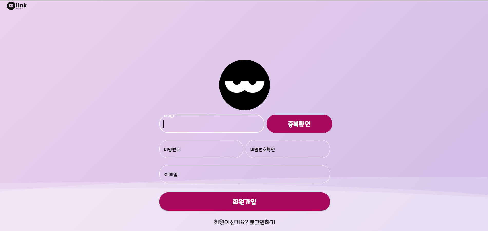

#### 이메일 인증

- 이메일 인증을 완료하지 않은 상태에서 로그인을 시도하면 인증을 요구하는 팝업창이 뜹니다.
- 회원가입 시 입력한 이메일로 인증할 수 있는 메일이 보내집니다.

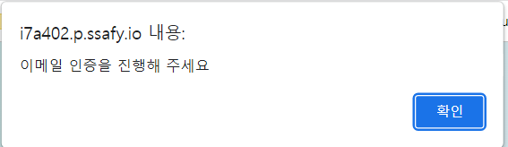

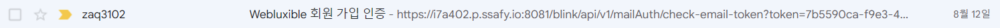

#### 방 만들기

- 2:2, 3:3, 4:4 미팅 방 중 하나를 선택하여, 방의 최대 인원수를 설정할 수 있습니다.
- 블라인드 미팅을 즐길 수 있는 방은 가입한 유저만 생성할 수 있습니다.

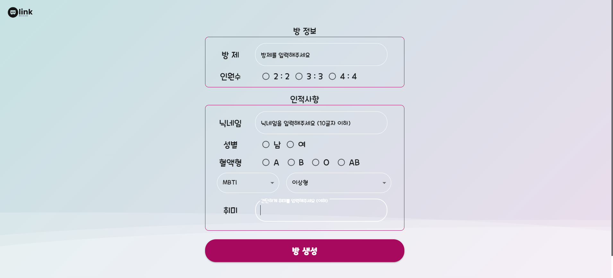

#### 방 입장하기

- 비회원의 경우 링크를 통해 입장이 가능합니다.

- 링크를 통해 웹 페이지로 들어오면, 닉네임과 인적사항을 적고 참가합니다.

  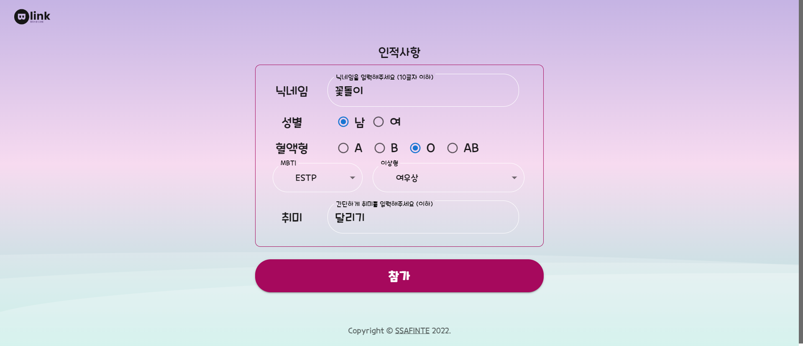

#### 게임 대기

- 방에 입장하면 자동으로 필터가 적용된 화면이 송출됩니다.

- 방에 대기 중인 인원들은 성별에 따라 남성 채팅 방과 여성 채팅 방으로 분류되어 같은 성별끼리 채팅을 즐길 수 있습니다.

- 미팅을 시작할 준비를 각자 마치면 준비 버튼을 누릅니다.

- 방에 참가한 모든 인원이 준비 버튼을 누르면, 게임이 시작됩니다.

  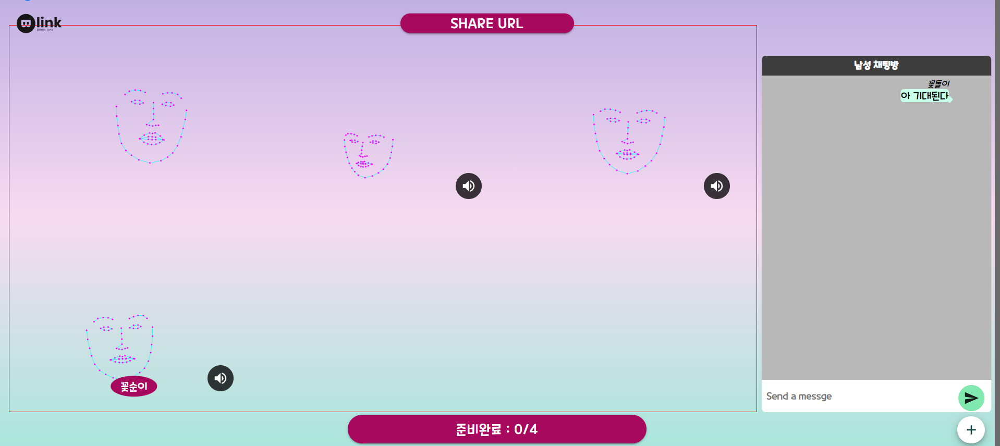

  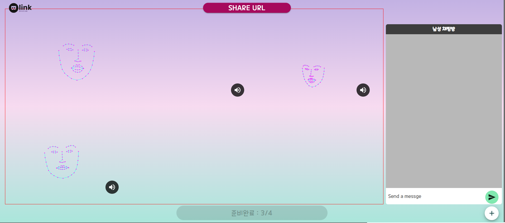

#### 자기 소개 시간

- 각자 1분씩 자기소개 시간이 주어집니다.

- 한 사람에게 할당된 자기소개 시간이 끝나면, 다음 차례 사람이 지목됩니다.

- 자기소개가 모두 끝나면 첫 인상 선택이 시작됩니다.

  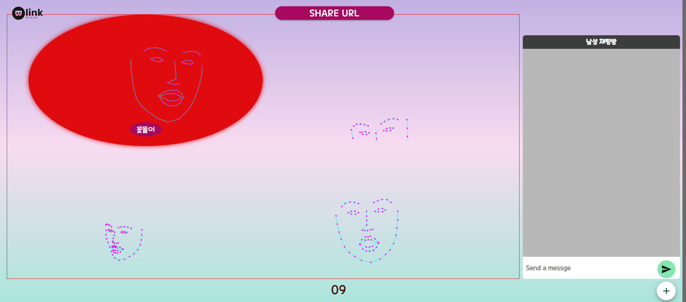

#### 첫 인상 선택

- 자기 소개 시간 때 가장 호감이 갔던 인물에게 투표 합니다.

- 투표 결과는 알 수 없으며, 이 후 이어지는 게임의 승자만 확인 가능합니다.

- 첫 인상 선택이 끝나면 라이어 게임이 시작됩니다.

  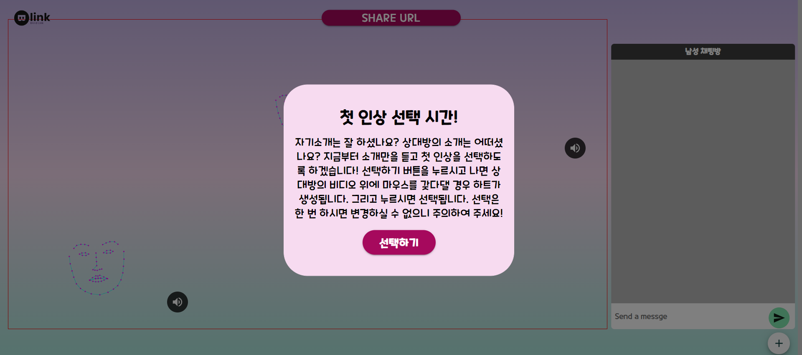

  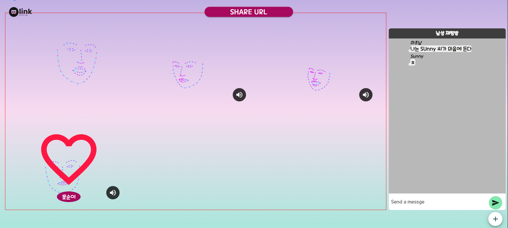

#### 라이어 게임

- 미팅 방에 입장할 때 입력한 MBTI를 활용한 게임입니다.
- 각 사람에게 거짓말쟁이 혹은 선량한 사람 역할이 부여됩니다.
- MBTI 성향을 파악할 수 있는 총 4가지 질문이 나옵니다.
- 본인의 성향에 맞는 답을 고르고 답변에 대한 토의 시간을 가집니다.
- 토의 내용과 자기 소개를 바탕으로 거짓말쟁이를 투표합니다.
- 거짓말쟁이를 맞춘 사람은 1점을 얻고, 틀리면 1점을 잃습니다.
- 거짓말쟁이는 기본적으로 1점을 얻고 시작합니다.
- 게임이 끝난 후, 최종 점수가 가장 높은 참가자는 앞서 진행한 첫 인상 선택의 결과를 볼 수 있습니다.

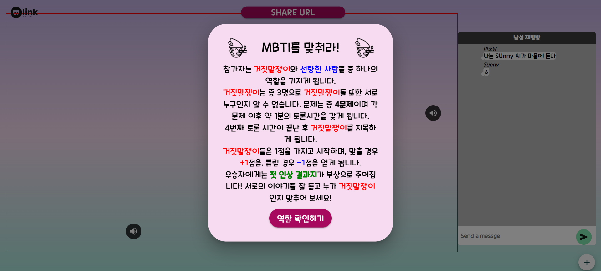

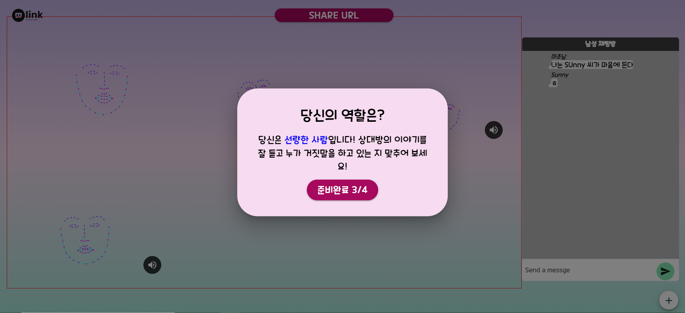

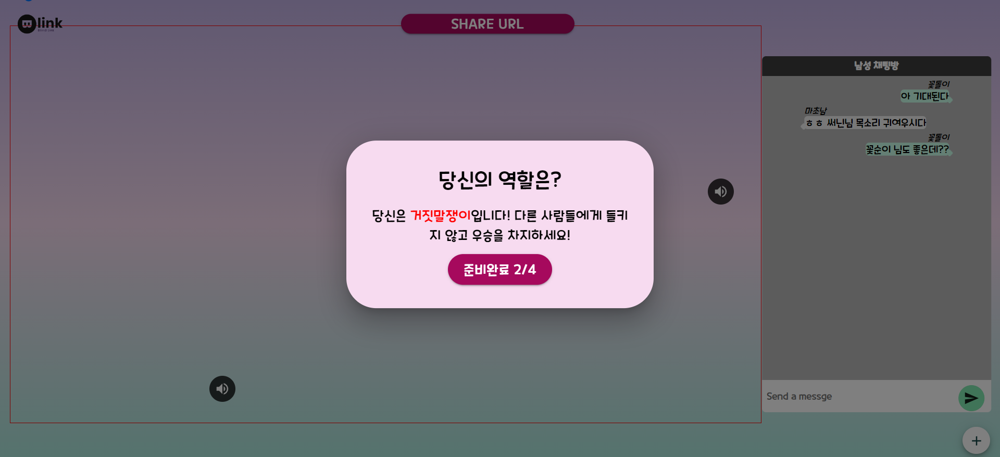

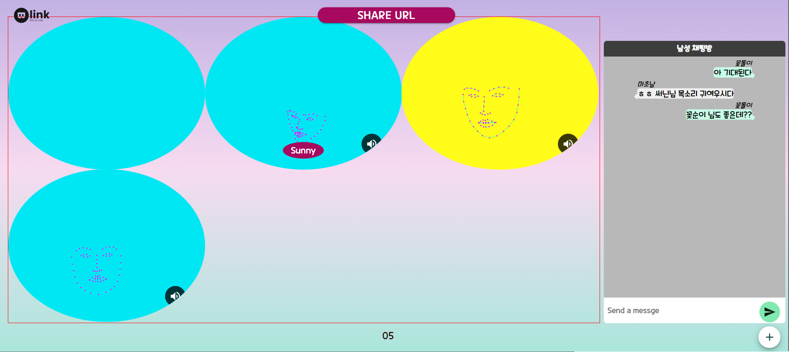

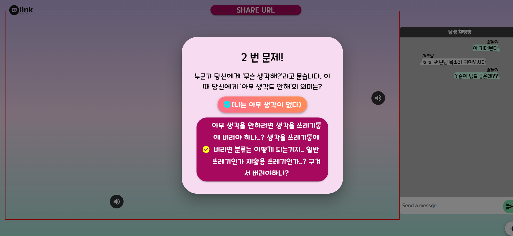

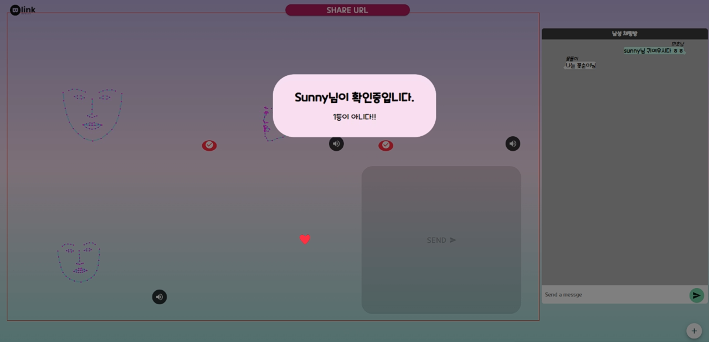

#### 자유 시간

- 라이어 게임이 끝나고 나면, 자유 대화 시간이 주어집니다.

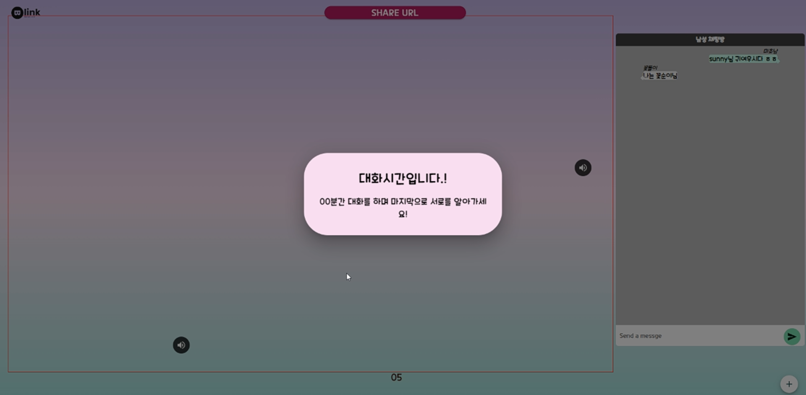

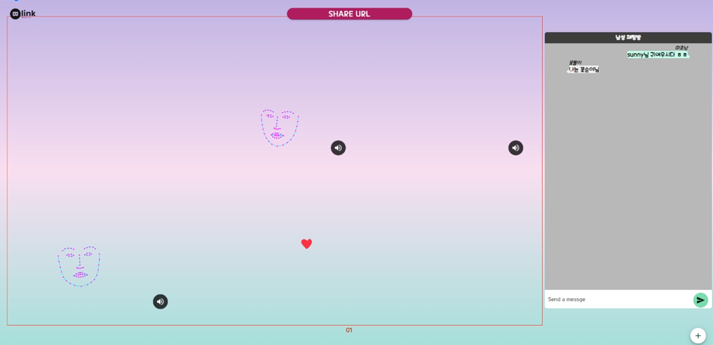

### 최종 선택

- 최종적으로 가장 마음에 드는 사람을 선택합니다.
- 서로를 선택하면 매칭된 것으로 판단되어, 방에 남습니다.
- 매칭되지 않은 사람들은 연결이 종료됩니다.
- 방에 남은 인원들은 자유롭게 이야기 할 수 있습니다.

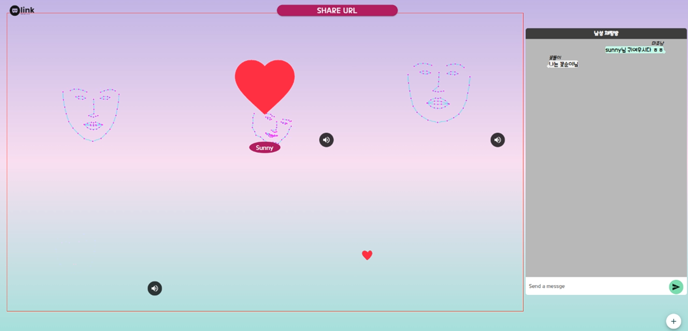

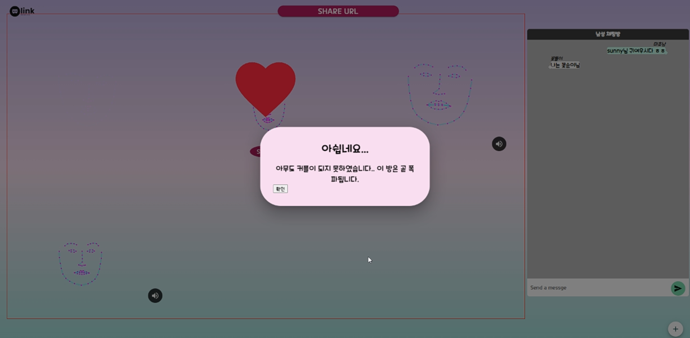

#### 주요 기능 

----

- **서비스 설명 : 얼굴을 가린채 쉽게 온라인상에서 부담없이 새로운 친구를 사귈수 있는 미팅 프로그램**

- **주요기능:**
  - **webRTC(openvidu) 와 Face API 을 통한 얼굴인식 블라인드 미팅**
  - **MBTI 맞추기 게임과 첫인상 평가를 통한 서로의 호감 표시**
  - **최종선택 일치시  블라인트 필터 제거 후 만남 진행**

​			

#### 사용 기술스택

---

**Backend**

- **sts-3.9.14.RELEASE**

- **Gradle 6.8.3**

- **Spring-boot-jpa**

- **Spring Security**

- **Java 8**

- **mysql**

- **JWT**

  

**Frontend**

- **Visual Studio Code**
- **React.js 18.2.0**
- **Material-UI 5.9.2**
- **redux 4.2.0**
- **face-api.js 0.22.2**
-  **socket.io 4.5.1**
- **node.js**

**Web RTC**

-  **openvidu 2.22.0**

**Face recognition**

- **face-api.js 0.22.2**

**CI/CD**

- **aws ec2**
- **docker**
- **nginx**

#### 서비스 아키텍쳐

---

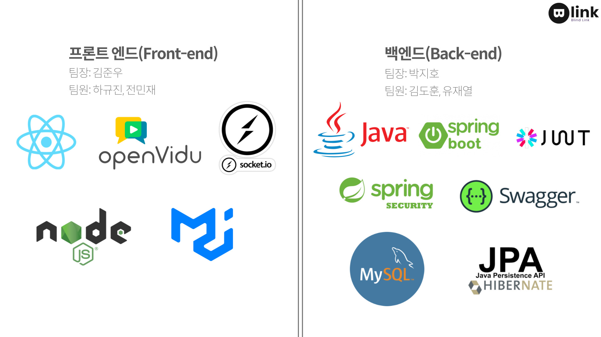

#### 포팅 메뉴얼

---

**포팅 메뉴얼은 "여기"를 참고하세요**

#### 기술 특이점

---

- **face-api.js**

  **얼굴 블라인드 처리를 위해 사용한 face recognition javaScript API 입니다.**
  
  ****
  
  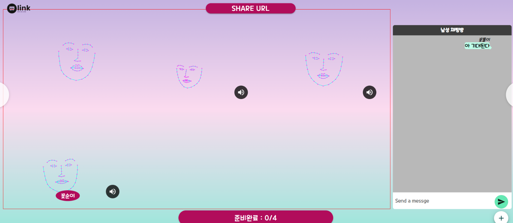
  
  **위 사진과 같이 본인의 얼굴은 블라인드 처리하고 실시간으로 얼굴 포인트를 확인해 표정만 확인 할 수 있도록 서비스에 맞게 구현하였습니다.**
  
  

- **WebRTC (Openvidu)**

   **Openvidu 기본 기능뿐만 아니라 Openvidu  백엔드와 연결하는 과정을 통해 여러가지 기능을 커스터 마이징했습니다. 인원 수 를 지정하거나 , 컴포넌트 안에서 첫인상 선택과 , 최종선택 과 같은 부분을 백엔드와의 연동을 통해 진행 할수 있게 처리하였고 , 아이스브레이킹 을 할수있는 시간인 MBTI 을 맞추는 게임 구현을 통해  비대면 상황이지만 서로를 빠르게 알아 갈 수 있습니다.**

  

- **FrontEnd**

  **Reatc 와 Redux 사용을 통해 상태관리와 구현을  진행하였고 , Material-UI 을 통해 CSS 을 구성하였습니다.** (소켓서버내용써줘) 

  

- **BackEnd**

  **Spring-boot 와 Spring Security 을 이용해 백엔드를 구성했고 JPA와 JWT 토큰을 사용하였습니다.**

- 배포

  (배포내용 써줘)

#### API 기능 명세서

---

#### 화면 설계서

---

https://www.figma.com/file/ZFwXvp9pnDf8uTQIsCI8d0/%EC%99%80%EC%9D%B4%EC%96%B4%ED%94%84%EB%A0%88%EC%9E%84FIN

#### 협업툴

---

- Git
- Jira
- Notion
- Mattermost
- Webex
- figma

#### GIT 컨벤션

---

### Commit Convention

- `Feat` : 새로운 기능을 추가할 경우
- `Fix` : 버그를 고친 경우
- `Update` : 코드 수정

### branch Convention

- `master` : 제품 출시될 수 있는 브랜치
- `develop` : 다음 출시 버전 개발하는 브랜치
- `feature` : 기능을 개발하는 브랜치 (기능 별 생성후 병합)

#### Notion

---

협업과 모두가 봐야할  공지나 명세서를 모아 관리하고 , 주마다 기록한 회의록 , 모두가 보면 좋은 공부내용을 정리해 올렸습니다. 

#### JIra

----

협업과 일정 관리를 위해 Jira 을 이용했습니다. 매주 월요일 오전 회의를 통해 한주동안 진행할 계획을 짜고 이슈들을 등록해 일주일 단위로 스프린트를 만들어 등록했습니다. 

#### **ER Diagram**

---

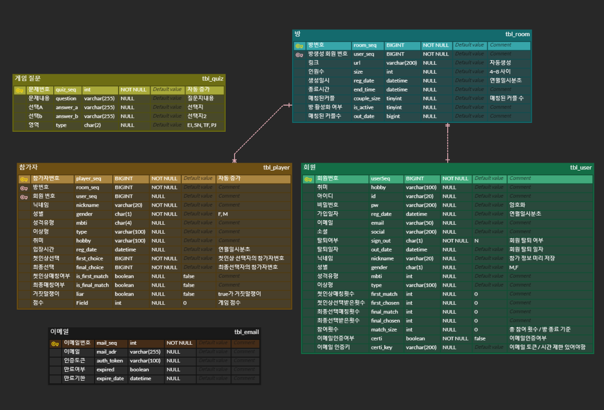

#### EC2 포트 정리

----

(지호형 도와줘)

| **PORT** | **이름**                                                |
| -------- | ------------------------------------------------------- |
| 443      | HTTPS                                                   |
| 80       | HTTP - HTTPS로 리다이렉트(프론트 페이지지로 리다이렉트) |
| 8443     | Openvidu                                                |
| 8379     | Redis                                                   |
| 3306     | MySQL                                                   |
| 8081     | Jenkins                                                 |
| 8080     | Spring boot Docker Container                            |
| 3000     | React, NginX Docker Container                           |

#### SSAFINITE 의 팀원을 소개합니다.

----

|                          **하규진**                          |                          **전민재**                          |                          **김준우**                          |                          **박지호**                          |                            유재열                            |                          **김도훈**                          |
| :----------------------------------------------------------: | :----------------------------------------------------------: | :----------------------------------------------------------: | :----------------------------------------------------------: | :----------------------------------------------------------: | :----------------------------------------------------------: |
|  |  |  | 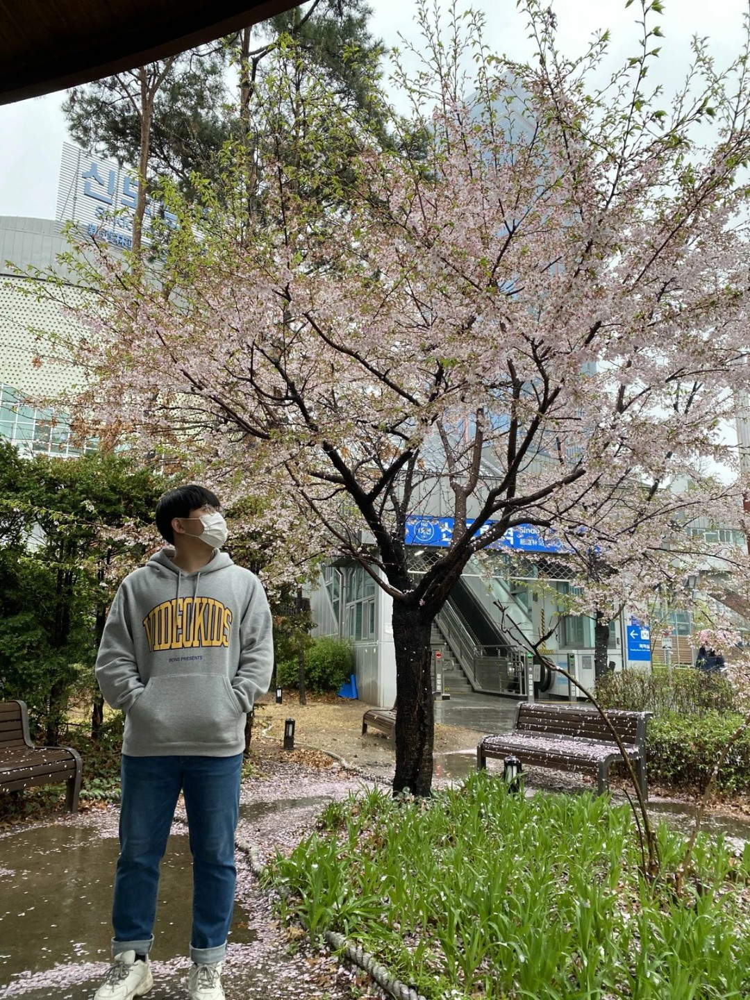 |  |  |
|                      Leader & FrontEnd                       |                           Frontend                           |                           Frontend                           |                           BackEnd                            |                           BackEnd                            |                           BackEnd                            |

#### 팀원역할

**유재열** 

- **Face-api .js을 이용한 face recognition  필터구현** 

- **회원가입 CRUD API 구현**

- **로그인 CRUD API 구현**

- **openvidu 방 입장 백엔드 구현**

- **React 로그인 회원가입 Axios 연결 , Redux 연결** 

- **JWT 토큰을 이용한 로그인**

- **DB설계**

  

#### BLINK 개발회고

----

